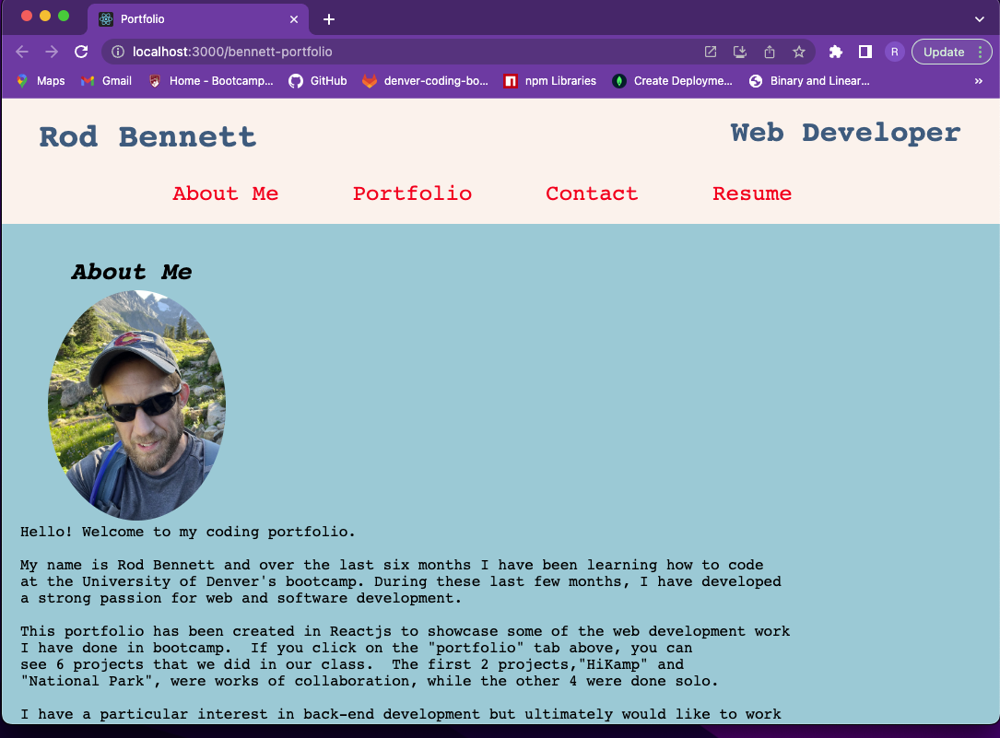
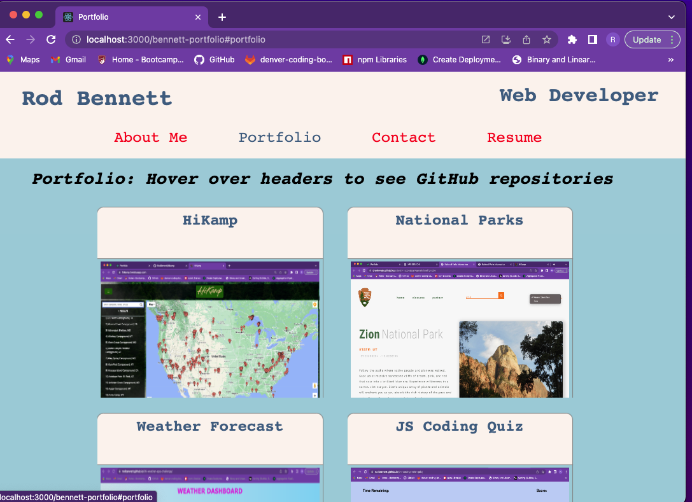
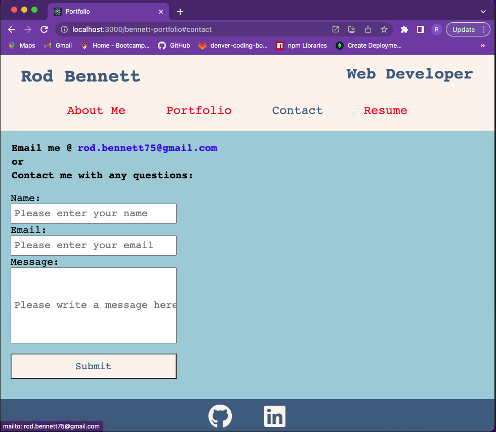

# 💼 React Portfolio
[](https://opensource.org/licenses/MIT)
## Overview

The code contained in this repository is my project portfoliio which exhibits six projects I have worked on during the University of Denver coding bootcamp. This application was built on Reactjs.  

### [Deployment Link](https://rodbennett.github.io/bennett-portfolio/)

## Table Of Contents
- [Acceptance Criteria](#acceptance-criteria)
- [Static Screenshots](#static-screenshots)
- [Installation](#installation)
- [Challenges](#challenges)
- [Future Development](#future-development)
- [Contributing](#contributing)
- [Technology Used](#technology-used)
- [Contact Info](#contact-info)

## Acceptance Criteria
 
```md
GIVEN a single-page application portfolio for a web developer
WHEN I load the portfolio
THEN I am presented with a page containing a header, a section for content, and a footer
WHEN I view the header
THEN I am presented with the developer's name and navigation with titles corresponding to different sections of the portfolio
WHEN I view the navigation titles
THEN I am presented with the titles About Me, Portfolio, Contact, and Resume, and the title corresponding to the current section is highlighted
WHEN I click on a navigation title
THEN I am presented with the corresponding section below the navigation without the page reloading and that title is highlighted
WHEN I load the portfolio the first time
THEN the About Me title and section are selected by default
WHEN I am presented with the About Me section
THEN I see a recent photo or avatar of the developer and a short bio about them
WHEN I am presented with the Portfolio section
THEN I see titled images of six of the developer’s applications with links to both the deployed applications and the corresponding GitHub repositories
WHEN I am presented with the Contact section
THEN I see a contact form with fields for a name, an email address, and a message
WHEN I move my cursor out of one of the form fields without entering text
THEN I receive a notification that this field is required
WHEN I enter text into the email address field
THEN I receive a notification if I have entered an invalid email address
WHEN I am presented with the Resume section
THEN I see a link to a downloadable resume and a list of the developer’s proficiencies
WHEN I view the footer
THEN I am presented with text or icon links to the developer’s GitHub and LinkedIn profiles, and their profile on a third platform (Stack Overflow, Twitter)
```

## Static Screenshots






## Installation
As this is a fully front-end app, no installation is required.

## Challenges
Ultimately, all of the hardest challenges had to do with styling because I haven't done this level of it in quite a while. Learning React had a few challenges, but it is more intuitive than some of the other MVC models we have learned in this course. For this project, I decided to use SASS for styling, which was great (the nesting element is extrememly useful) and I intend to use it from now on.  However, like anything else, there was a learning curve involved.  

## Future Development
Our final group project is coming up, and I feel very comfortable using React, at least on the front-end.  But we have dabbled in back-end functionality for React and is seems more straightforward than the HandleBars engine we used before.

## Contributing
[](code_of_conduct.md)

As this is an assignment for a coding bootcamp, outside contributions are discouraged.

## Technology Used
- [Reactjs](https://reactjs.org/): for front-end development
- [Nodejs](nodejs.org)
- [Github Pages](https://pages.github.com/): for deployment

## Contact Info
- [Email me](rod.bennett75@gmail.com)
- [My Github Profile](https://github.com/RodBennett)

